# Cognitive Services
Cognitive - '인지'라는 뜻의 영어 단어 입니다. 사진을 보고 상황을 파악하고, 문장을 읽고 의미를 이해할 수 있는 등 인지와 관련된 서비스를 제공하는 것이 바로 
마이크로소프트의 [Cognitive Services](https://www.microsoft.com/cognitive-services/en-us/) 입니다. 매년 3월 말에 개최되는 개발자 행사인 Build 에서 2016년에 소개되었으며, 기존에는 Project Oxford 라고 불려져 왔던 프로젝트 입니다. 
Vision, Speech, Language, Knowledge, Search 이렇게 다섯개 분야로 나누어져 있으며, 현재 총 24개의 서비스를 제공하고 있습니다.

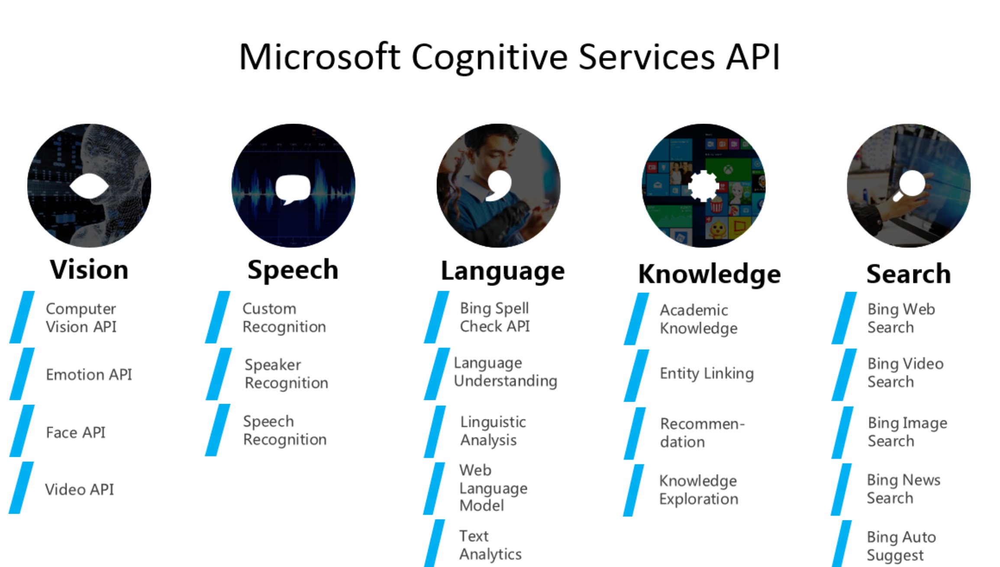

Cognitive 서비스를 본격 설명하기 전에 앞서, 이를 이용한 재미있는 웹사이트 하나 간단히 소개해 드리도록 하겠습니다. 
바로 [Captionbot.ai](https://www.captionbot.ai/) 입니다!

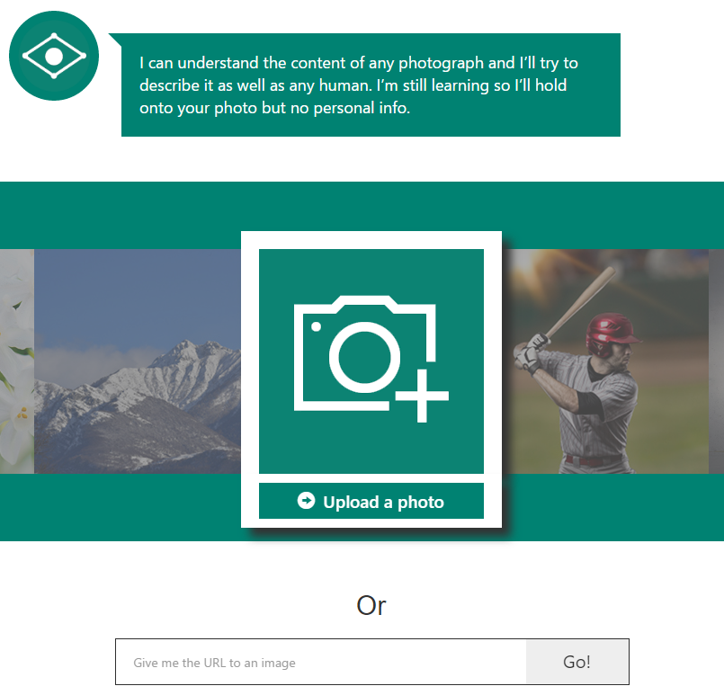 

사진 중의 하나를 선택하시거나, 직접 사진을 업로드 하거나 혹은 인터넷상의 사진 URL을 입력하여 테스트 해보 실 수 있습니다.
제시된 사진중 하나를 선택하여 결과를 확인해 보겠습니다. 

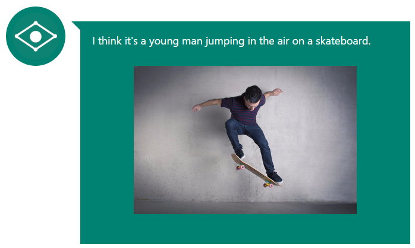 

마치 컴퓨터에 눈이 달린것 처럼 상당히 정확하게 사진을 분석합니다. 
좋아하는 연예인 사진이나, 멋진 곳에서 친구들과 찍은 사진을 이용하여 테스트 해보시기 바랍니다.

위에서 소개해 드린 것 처럼 Cognitive Services를 웹서비스 형태로 이용하실 수 있습니다.
하지만, 이러한 경우 내가 만든 서비스에 활용하기는 어려움이 많습니다. 
그래서 개발자들이 Cognitive Services를 쉽고, 편리하게, 널리 이용할 수 있도록 API나, SDK 로 제공하고 있습니다. 

VISION API의 경우 API Document 및 SDK를 아래의 페이지에서 확인하실 수 있습니다. 
* [Vision API - API Documentation](https://dev.projectoxford.ai/docs/services/56f91f2d778daf23d8ec6739/operations/56f91f2e778daf14a499e1fa)

* [Vision API - SDK](https://www.microsoft.com/cognitive-services/en-us/SDK-Sample?api=computer%20vision)

Cogniive API를 이용하는 방법은 그리 어렵지 않습니다. 
아 참! 그전에 필요한게 하나 있습니다. 로그인이 필요합니다! 
Microsoft 계정이나, GitHub 계정 혹은 LinkedIn 계정 중 1개만 있으면 됩니다.

## Cognitive Services 서비스 등록 방법

### Step1. Cognitive Services 사이트 접속
: [https://www.microsoft.com/cognitive-services/en-us/](https://www.microsoft.com/cognitive-services/en-us/)

### Step2. 우측 상단의 'Get Started for free' 클릭
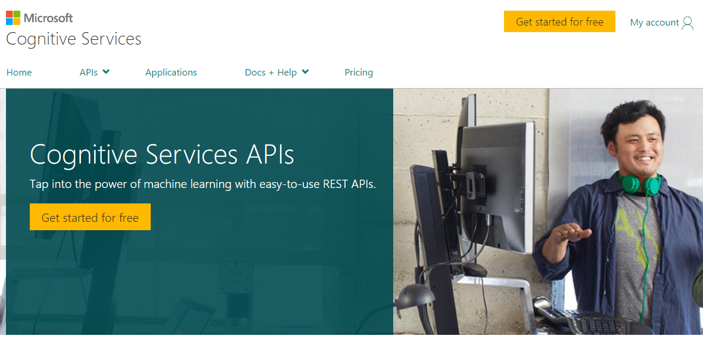  

### Step3. Sign up
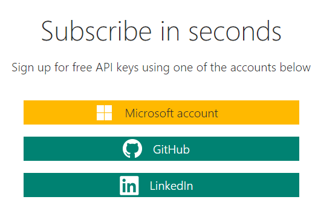 

Microsoft account 를 이용하여 로그인 해보겠습니다. 

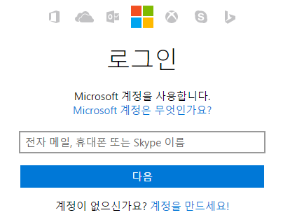 

아이디, 비밀번호를 입력합니다.

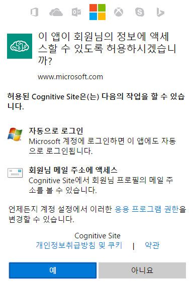 

약관에 동의합니다.

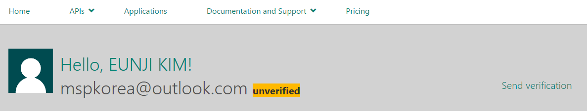 
메일 계정이 아직 확인 되지 않은 상태입니다. Send Verification을 누릅니다.

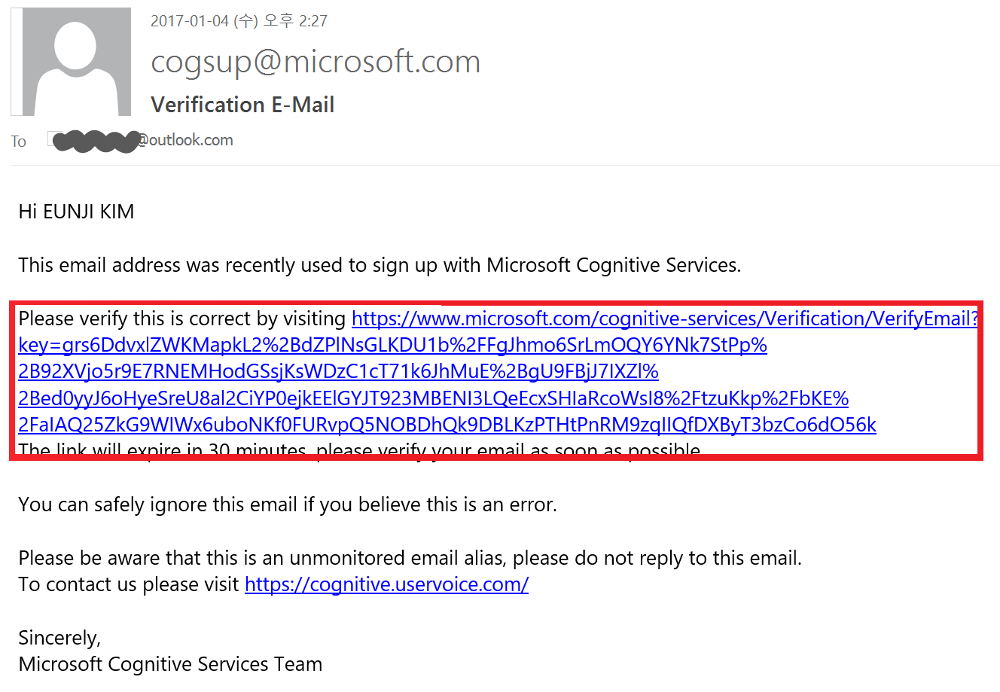 

메일이 도착하면 링크를 클릭하여 인증을 하시기 바랍니다.

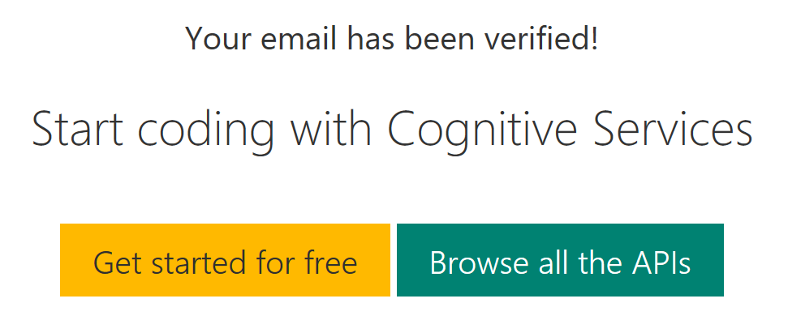 

이러한 화면이 뜨면 성공적으로 인증이 되셨습니다.
이제 그러면 API 중 하나를 사용하기 위해 사용 요청을 해보도록 하겠습니다.
Vision API를 선택해 보도록 하겠습니다. 

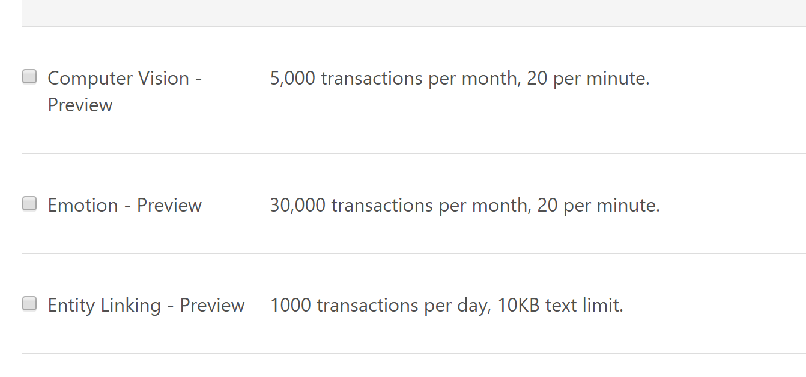 

API 중 Vision API를 선택합니다.

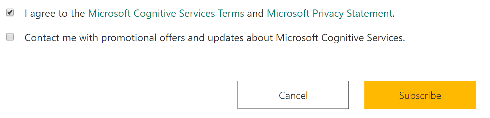 

아래의 약관에 동의를 하시고 계속 진행 하시기 바랍니다.

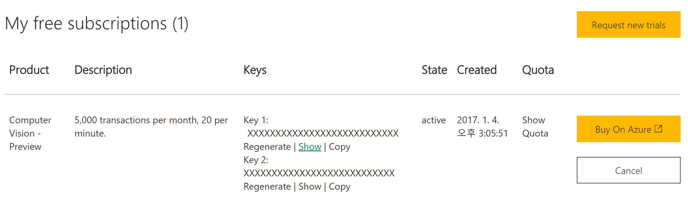 

Vision API를 사용할 수 있는 Key를 발급받으셨습니다. 키를 복사하여 API 요청시 사용하실 수 있습니다. 

## API 테스트 해보기
[Computer Vision API - API Reference](https://dev.projectoxford.ai/docs/services/56f91f2d778daf23d8ec6739/operations/56f91f2e778daf14a499e1fa/console) 페이지에서 간단하게 테스트를 해보실 수 있습니다. 
Analyze Image 탭에서 위에서 발급 받은 키를 입력해 주시기 바랍니다. 

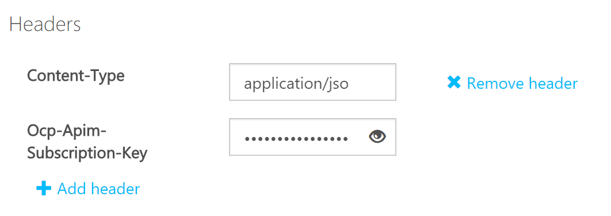 

Request Body 부분의 url에 Test 하고싶은 이미지의 url을 붙여 넣으시기 바랍니다. 

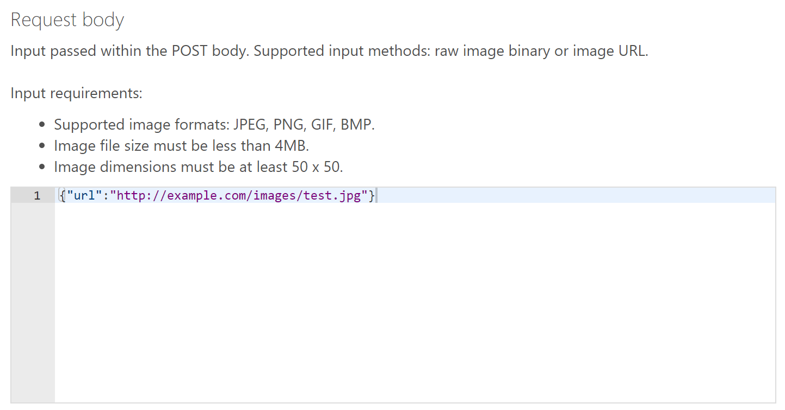 

