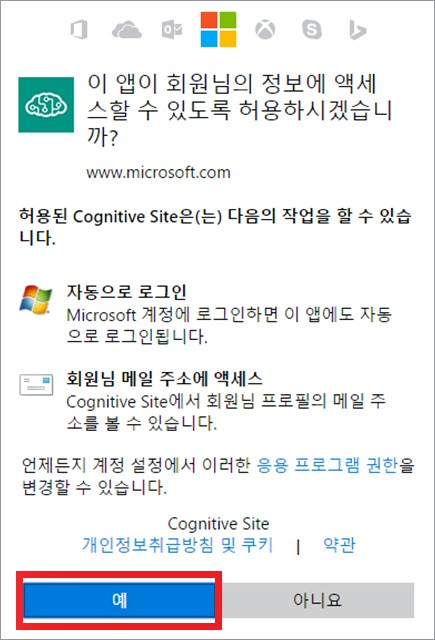
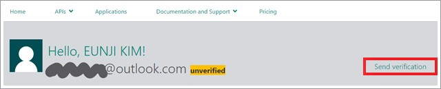
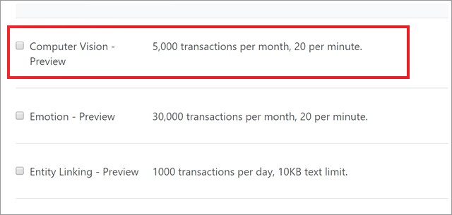

# Cognitive Services
Cognitive - '인지'라는 뜻의 영어 단어 입니다. 사진을 보고 상황을 파악하고, 문장을 읽고 의미를 이해할 수 있는 등 인지와 관련된 서비스를 제공하는 것이 바로 
마이크로소프트의 [Cognitive Services](https://www.microsoft.com/cognitive-services/en-us/) 입니다. 
Vision, Speech, Language, Knowledge, Search 이렇게 다섯 가지 분야에 총 24개의 서비스를 제공하고 있습니다.

+ Vision 
    * [Computer Vision](https://www.microsoft.com/cognitive-services/en-us/computer-vision-api)
    * [Computer Moderator](https://www.microsoft.com/cognitive-services/en-us/content-moderator)
    * [Emotion](https://www.microsoft.com/cognitive-services/en-us/emotion-api)
    * [Face](https://www.microsoft.com/cognitive-services/en-us/face-api)
    * [Video](https://www.microsoft.com/cognitive-services/en-us/video-api)

+ Speech
    * [Bing Speech](https://www.microsoft.com/cognitive-services/en-us/speech-api)
    * [Custom Recognition](https://www.microsoft.com/cognitive-services/en-us/custom-recognition-intelligent-service-cris)
    * [Speaker Recognition](https://www.microsoft.com/cognitive-services/en-us/speaker-recognition-api)

+ Language
    * [Bing Spell CHeck](https://www.microsoft.com/cognitive-services/en-us/bing-spell-check-api)
    * [Language Understanding](https://www.microsoft.com/cognitive-services/en-us/language-understanding-intelligent-service-luis)
    * [Linguistic Analysis](https://www.microsoft.com/cognitive-services/en-us/linguistic-analysis-api)
    * [Text Analytics](https://www.microsoft.com/cognitive-services/en-us/text-analytics-api)
    * [Translator](https://www.microsoft.com/cognitive-services/en-us/translator-api)
    * [WebLM](https://www.microsoft.com/cognitive-services/en-us/web-language-model-api)

+ Knowledge
    * [Academic](https://www.microsoft.com/cognitive-services/en-us/academic-knowledge-api)
    * [Entity Linking](https://www.microsoft.com/cognitive-services/en-us/entity-linking-intelligence-service)
    * [Knowledge Exploration](https://www.microsoft.com/cognitive-services/en-us/knowledge-exploration-service)
    * [QnA Maker](https://www.microsoft.com/cognitive-services/en-us/qnamaker)
    * [Recommendations](https://www.microsoft.com/cognitive-services/en-us/recommendations-api)    

+ Search
    * [Bing Autosuggest](https://www.microsoft.com/cognitive-services/en-us/bing-autosuggest-api)
    * [Bing Image Search](https://www.microsoft.com/cognitive-services/en-us/bing-image-search-api)
    * [Bing News Search](https://www.microsoft.com/cognitive-services/en-us/bing-news-search-api)
    * [Bing Video Search](https://www.microsoft.com/cognitive-services/en-us/bing-video-search-api)
    * [Bing Web Search](https://www.microsoft.com/cognitive-services/en-us/bing-web-search-api)

## 1.Cognitive Serivces 를 활용한 웹 사이트 소개  

Cognitive 서비스를 본격 설명하기 전에 앞서, 이를 이용한 재미있는 웹사이트 하나 간단히 소개해 드리도록 하겠습니다. 
바로 [Captionbot.ai](https://www.captionbot.ai/) 입니다!

 

사진에 대한 설명을 자동으로 생성해주는 재미난 웹사이트 입니다. 
사진 하나를 선택하시거나, 직접 파일을 업로드 하시거나 혹은 사진 URL을 입력하여 테스트 해보실 수 있습니다.
제시된 사진중 하나를 선택하여 결과를 확인해 보겠습니다. 

 

마치 컴퓨터에 눈이 달린것 처럼 상당히 정확하게 사진을 분석합니다. 
좋아하는 연예인 사진이나, 멋진 곳에서 친구들과 찍은 사진을 이용하여 테스트 해보시기 바랍니다.

아 참! 그전에 필요한게 하나 있습니다. 로그인이 필요합니다! 

## 2.Cognitive Serivces 등록 방법

Cognitive Services를 사용해보고 싶다는 마음이 드셨나요? 
Cognitive Services 사용을 위한 등록 절차를 단계별로 안내해 드리겠습니다. 

### Step1. Cognitive Services 사이트 접속
: [https://www.microsoft.com/cognitive-services/en-us/](https://www.microsoft.com/cognitive-services/en-us/)
Cognitive Serivce와 관련된 모든 정보를 확인할 수 있는 페이지로 이동합니다. 

### Step2. 우측 상단의 'Get Started for free' 클릭
  

### Step3. Sign up
 

Cognitive Services를 사용하기 위해서는 Microsoft 계정이나, GitHub 계정 혹은 LinkedIn 계정이 필요합니다. 
Microsoft 계정을 이용하여 로그인 해보겠습니다. 

 

아이디 및 비밀번호를 입력하고 로그인합니다.

 

약관에 동의합니다.

 

메일 계정이 아직 확인 되지 않은 상태입니다. Send Verification을 누르면 해당 메일 계정으로 Verification 메일이 전송됩니다.

 

메일이 도착하면 링크를 클릭하여 인증을 하시기 바랍니다.

 

이러한 화면이 뜨면 성공적으로 인증이 되셨습니다. 
이제 그러면 API 사용 요청을 해보도록 하겠습니다.
API 중 Vision API를 선택해 주시기 바랍니다. 

 

API 중 Vision API를 선택합니다.

 

위의 약관에 동의를 하시고 계속 진행 하시기 바랍니다.

 

Vision API를 사용할 수 있는 Key를 발급받으셨습니다. 키를 복사하여 API 요청시 혹은 SDK에서 사용하실 수 있습니다. 

## 3.Cognitive API 및 SDK 사용 방법  

위에서 소개해 드린 것 처럼 마이크로소프트의 Cognitive Services를 활용한 재미난 웹사이트들이 많이 있습니다.
하지만, 이를 내가 만든 서비스에 직접 활용하기는 어려움이 있습니다. 
개발자들이 쉽고 편리하게 이용할 수 있도록 API나, SDK 형태로도 제공하고 있습니다. 

VISION API의 경우 API Document 및 SDK를 아래의 페이지에서 확인하실 수 있습니다. 

* [Vision API - API Documentation](https://dev.projectoxford.ai/docs/services/56f91f2d778daf23d8ec6739/operations/56f91f2e778daf14a499e1fa)
* [Vision API - SDK](https://www.microsoft.com/cognitive-services/en-us/SDK-Sample?api=computer%20vision)

Cognitive API를 테스트 해볼 수 있는 API Testing Console에서 API 사용법을 간단하게 안내해 드리겠습니다. 

## API 테스트 해보기
 

[Computer Vision API - API Reference](https://dev.projectoxford.ai/docs/services/56f91f2d778daf23d8ec6739/operations/56f91f2e778daf14a499e1fa/console) 페이지에서 간단하게 API를 테스트 해보실 수 있습니다. 
Headers의 Ocp-Apim-Subscrption-Key에 위에서 발급 받은 키를 붙여넣어 주시기 바랍니다. 

 

Request Body 부분의 url에 Test 하고싶은 이미지의 url을 입력하시기 바랍니다. 

 
 

위와 같은 형태로 요청을 전송할 예정입니다. 이미지에 해당하는 url과 자신의 Subscrption Key를 붙여 넣으셨다면 Send 버튼을 누르시기 바랍니다. 

 

200번 응답을 받으면 성공적으로 응답을 받은 것 입니다. JSON 포멧으로 Response를 받으실 수 있으며 이를 적절히 변형하셔서 개인 프로젝트에서 이용하시면 됩니다.
긴 포스트 읽으시느라 수고 많으셨습니다! 
마이크로소프트의 Cognitive Services를 이용하여 재미난 애플리케이션 만들어 보시기 바랍니다! 

