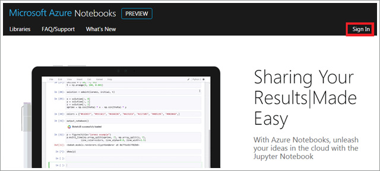

# Azure Notebooks

## 1.Azure Notebooks 서비스 소개 
[Azure Notebooks](https://notebooks.azure.com/) 라는 서비스를 소개합니다! 혹시 Jupyter Notebook이라는 서비스 들어보셨나요? Jupyter Notebook은 실행 가능한 코드 및 시각화된 결과를 별도의 환경설정 없이 웹 애플리케이션 상에서 확인할 수 있게하는 오픈소스 프로젝트입니다. 
자세한 정보는 [jupyter.org](http://jupyter.org/) 페이지에서 확인하실 수 있습니다. Azure Notebook을 한마디로 소개하자면 마이크로소프트 클라우드인 Azure에서 호스팅 되고있는 Jupyter Notebooks 서비스 입니다. 
무료로 사용하실 수 있으며 현재는 아직 프리뷰 버전입니다만, 굉장히 편리한 서비스로 여러분들께 소개해드리고자 합니다. 

Azure Notebooks 페이지인 [https://notebooks.azure.com/](https://notebooks.azure.com/)에 접속해주시기 바랍니다. 

 

Get Started 버튼을 클릭하시면 미리 작성되어 있는 노트북 목록을 확인하실 수 있습니다. Azure Notebooks - Welcome.ipynd 파일에서는 Azure Noteboks 서비스에 대한 전반적인 소개 및 관련 자료들을 안내하고 있습니다. 

 

우측의 눈(eye) 모양을 클릭하시면 로그인 없이도 문서를 확인하실 수 있습니다. Notebooks 서비스에 대한 전반적인 안내사항이 담겨있는 문서 외에도, R 및 Python 등등에 관한 문서를 확인해 보실 수 있습니다. 
그러면 이제부터 Azure Notebooks를 함께 만들어 보도록 하겠습니다.  

## 2.Azure Notebooks 계정 등록 방법

### Step1. Microsoft 계정으로 로그인 하기
 

[Azure Notebooks](https://notebooks.azure.com/) 페이지에 접속하셔서 Sign In 버튼을 누르시기 바랍니다. 

 

Microsoft 계정을 이용하여 로그인 하시기 바랍니다. 없으시다면.. 이 기회에 하나 만드세요!


'예' 버튼을 눌러서 계속 진행하시기 바랍니다.

### Step2. 새로운 Notebook 생성하기 


Azure Notebooks 메인 페이지에서 Get Started 버튼을 눌러 주세요.


위와 같이 기본 설정 값인 Sample notebooks 라이브러리에 들어있는 파일 목록을 확인하실 수 있으실 겁니다.
Home 버튼을 눌러서 홈 디렉토리로 이동해 보겠습니다.


홈 디렉토리로 이동한 모습입니다. 기본적으로 생성되는 Sample notebooks 라이브러리만 있습니다. 새로운 라이브러리를 추가해 보도록 하겠습니다. 


New Library 버튼을 클릭하시기 바랍니다. 


Library Name: My First Library, Library Description: First Library 라고 입력해 주시고 Create 버튼을 눌러 생성해 주시기 바랍니다.


My First Library 라는 이름의 라이브러리가 생성되었음을 확인하실 수 있습니다.
이제 라이브러리에 노트북을 추가해 보도록 하겠습니다.


라이브러리 이름을 클릭하시면 해당 라이브러리에 접속하실 수 있습니다.
첫 번쨰 노트북을 추가해 보도록 하겠습니다.


노트북을 추가하도록 하겠습니다. Open in Jupyter 버튼을 클릭하시기 바랍니다.  


위와 같이 비어있는 화면을 확인하실 수 있습니다. 


우측 상단의 New 탭을 확장한 후 "Python 3"를 선택하시기 바랍니다. 


위와같이 비어있는 노트북 화면을 확인하실 수 있습니다. 
무언가를 작성해보기 전에 Juypter 사용법에 대해 간략히 소개해 드리겠습니다. 
Jupyter란 웹 브라우저에 기반을 둔 강력한 실행 환경입니다. Azure Notebooks 에서는 R, Python 2, Python 3 를 수행할 수 있는 커널을 제공합니다.
Notebook 툴바에서 각 항목은 아래와 같은 기능을 제공합니다.


여기서 등장하는 Cell 이라는 것에 대해 잠깐 소개해드리고 넘어가겠습니다. 
노트북은 코드가 동작하는 수행 환경이면서 동시에 코드에 대한 설명을 markdown 문법으로 작성하실 수도 있습니다. 

그림

즉, 위의 이미지와 같이 코드와 설명을 사용자들이 이해하기 쉽게 작성할 수 있는 것이죠. 
Cell 단위로 markdown 부분인지, code를 작성한 부분인지 지정해 주어야 합니다. 
그럼 markdown 문법 및 Python 3 를 이용하여 간단한 노트북 파일을 작성해 보도록 하겠습니다.

 

위의 그림처럼 markdown을 선택하고 text block에 아래의 내용을 붙여넣습니다. 

```
# My First Notebook
저의 첫번째 Azure Notebooks 예제입니다.
```

 

markdown 문법을 이용하여 첫번째 셀을 작성하셨습니다. 이제 Python 코드로 이루어진 두번째 셀을 작성해 보겠습니다. 
'+' 버튼을 누르시고 드롭다운 목록에서 Python 3를 선택하시기 바랍니다.
그리고 아래의 코드를 입력하시기 바랍니다.

```
a = 2+3
str = 'Hello' + 'Notebook'
print(a)
print(str)
```

 

Run 버튼을 눌러서 코드를 실행해 보겠습니다. 아래와 같은 실행결과를 얻으실 수 있습니다.

 


